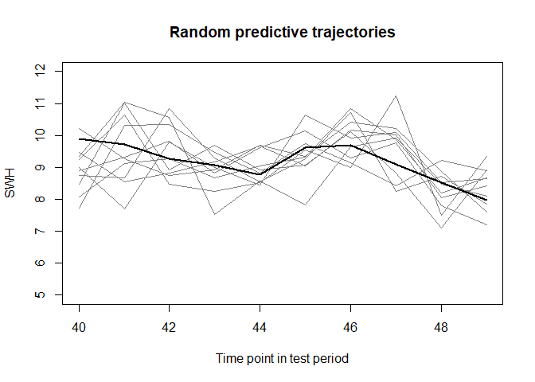
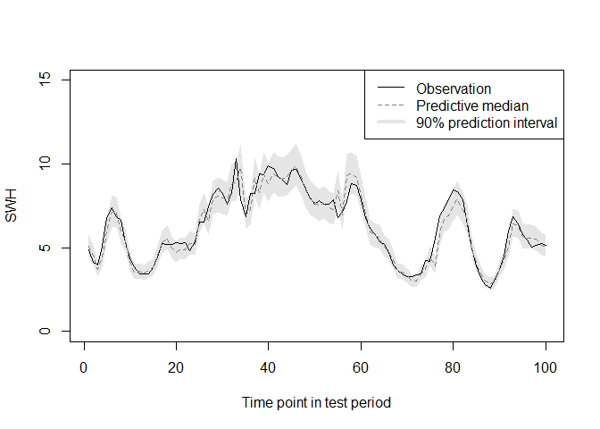

# The rSWHAP package

### Significant Wave Height Analysis and Prediction

#### Authors: Hugo L. Hammer, Tor Arne Oigard, Thordis Thorarinsdottir and Hanne Rognebakke

-----

## Overview

The rSWHAP package contains a statistical model for Significant Wave
Heights (\(H_s\)) using Seal Level Pressure and spatial information as
covariates. This document describes how to install the package and how
to fit the statistical model to a sample data set which is included.
Several diagonostick tools, both numerical and visual, are implemented
to state the goodness-of-fit of the statistical model.

### Installation and loading the rSWHAP package

The rSWHAP package depends on the following R-packages

  - *glmnet*
  - *forecast*
  - *moments*

<!-- end list -->

These dependencies will be automatically installed when installing the
rSWHAP package.

The most recent version of the *rSWHAP* package is hosted on a git
repository at <https://github.com/NorskRegnesentral/rSWHAP.git>.

In order to install the rSWHAP package run the following command:

``` r
devtools::install_github("NorskRegnesentral/rSWHAP", build_vignettes = TRUE)
```

In order to load the package type:

``` r
library(rSWHAP)
```

To load the vignette type:

``` r
vignette("instructions",package = "rSWHAP")
```

### Example data

A small example data set is included in the R-package. ERA-Interim
reanalysis of significant wave height (\(H_s\)) and sea level pressure
(SLP) over the area \(53.25^{\circ}\) to \(- 57.75{\circ}\) longitude
and \(54.00^{\circ}\) to \(58.5^{\circ}\) latitude and for the period
2006 to 2015. The years 2006 - 2014 are used in this example to
calibrate and evaluate different statistical models for \(H_s\), and
year 2015 is used for model evaluation. The data has spatial resolution
of \(0.75^{\circ} \times 0.75^{\circ}\) and temporal resolutions of six
hours.

The table below lists the various variables in the data set.

| Variable name | Description                                |
| :------------ | :----------------------------------------- |
| SWH           | Significant Wave Height                    |
| SLP           | Sea Level Pressure                         |
| SLP.grad      | Gradient of Sea Level Pressure             |
| latitudeSWH   | Latitude values of SWH                     |
| longitudeSWH  | Longitude values of SWH                    |
| latitudeSLP   | Latitude values of SLP                     |
| longitudeSWH  | Longitude values of SLP                    |
| time.all      | Time stamps of each ERA-Interim data point |
| years.all     | Year stamp of each ERA-Interim data point  |

When the R-package is loaded, the data can be loaded using

``` r
data("ERAInterim")
```

To see summary statistics of the SWH in the data:

``` r
summary(SWH)
```

    ##    Min. 1st Qu.  Median    Mean 3rd Qu.    Max. 
    ##  0.4726  2.1296  3.0538  3.4142  4.3071 16.5310

For summary statistics of the SLP in the data:

``` r
summary(SLP)
```

    ##    Min. 1st Qu.  Median    Mean 3rd Qu.    Max. 
    ##   93301  100127  101100  100975  101975  104539

Summary statistics for the gradient of the SLP:

``` r
summary(SLP.grad)
```

    ##     Min.  1st Qu.   Median     Mean  3rd Qu.     Max. 
    ## 0.000000 0.004531 0.011082 0.017110 0.022871 0.538579

### Model fitting

Create Fourier terms to use in the modeling. The Fourier terms are
needed for modeling seasonality.

You need to specify the number of observations per year and the number
of Fourier terms. Default values are 365.25\*4 observations per year and
2 Fourier terms.

``` r
intercept.fourier = fourier(x = rep(1,length(time.all)))
```

Define the training set and the test set. In this example data from 2006
to 2014 is used for training and data from 2015 is used for testing
(this is also default values).

``` r
training.test = split.data(years = years.all,
                           trainingPeriod = 2006:2014,
                           testPeriod = 2015)
```

Next we fit the model to the training data by estimating the model
parameters and obtain predictive distributions. In the example below we
have chosen to use latitude cell 4 and longitude cell 4 (the data is a
7x7 latitude longitude grid).

``` r
pred.dist = getPreddistr(SWH = SWH,
          SLP = SLP, 
          SLP.grad = SLP.grad,
          latCell = 4, 
          longCell = 4,
          neig = 2,
          na.thresh = 500,
          latSWH = latitudeSWH,
          lonSWH = longitudeSWH,
          latSLP = latitudeSLP,
          longSLP = longitudeSLP,
          intercept.fourier = intercept.fourier,
          maxlag = 10)
```

    ## Total number of potential predictors used in LASSO selection: 69 
    ## Number of predictors selected by LASSO: 52 
    ## Fitting linear model with the variables from the LASSO selection...

    ## Registered S3 method overwritten by 'xts':
    ##   method     from
    ##   as.zoo.xts zoo

    ## Registered S3 method overwritten by 'quantmod':
    ##   method            from
    ##   as.zoo.data.frame zoo

    ## Registered S3 methods overwritten by 'forecast':
    ##   method             from    
    ##   fitted.fracdiff    fracdiff
    ##   residuals.fracdiff fracdiff

``` r
# Extract the mean, standard deviation and the 
# estimated lambda parameter for the predictive
# distribution.
pred.mean = pred.dist$pred.mean
pred.sd = pred.dist$pred.sd
pred.lambda = pred.dist$pred.lambda

print(pred.dist$fits)
```

    ## 
    ## Call:
    ## lm(formula = SWH.bc.standard.training ~ ., data = predictors.training)
    ## 
    ## Residuals:
    ##      Min       1Q   Median       3Q      Max 
    ## -0.76520 -0.10036 -0.00888  0.09102  1.03424 
    ## 
    ## Coefficients:
    ##               Estimate Std. Error t value Pr(>|t|)    
    ## (Intercept)  8.826e-03  1.912e-03   4.615 3.97e-06 ***
    ## V1           3.879e-01  2.789e-02  13.908  < 2e-16 ***
    ## V2          -3.093e-01  2.319e-02 -13.340  < 2e-16 ***
    ## V4          -2.570e-02  8.679e-03  -2.961 0.003073 ** 
    ## V5          -1.649e-02  4.442e-03  -3.712 0.000206 ***
    ## V6           1.227e-01  1.683e-02   7.291 3.26e-13 ***
    ## V7          -7.061e-06  2.143e-02   0.000 0.999737    
    ## V8          -1.418e-02  3.901e-02  -0.364 0.716153    
    ## V9          -6.143e-04  2.416e-03  -0.254 0.799308    
    ## V10         -5.574e-03  2.476e-03  -2.251 0.024423 *  
    ## V11         -8.604e-03  2.406e-02  -0.358 0.720678    
    ## V12          8.637e-02  3.192e-02   2.706 0.006828 ** 
    ## V20         -3.691e-02  1.218e-02  -3.031 0.002443 ** 
    ## V22          1.210e-02  1.165e-02   1.039 0.298862    
    ## V23         -3.883e-03  4.536e-03  -0.856 0.392043    
    ## V24          3.937e-04  6.237e-03   0.063 0.949668    
    ## V25          7.161e-03  4.507e-03   1.589 0.112058    
    ## V26          8.851e-03  6.078e-03   1.456 0.145343    
    ## V27         -4.226e-03  6.881e-03  -0.614 0.539134    
    ## V28          5.444e-02  2.339e-02   2.327 0.019956 *  
    ## V29         -1.269e-02  9.536e-03  -1.331 0.183214    
    ## V30         -3.398e-02  2.142e-02  -1.587 0.112650    
    ## V31          1.456e-02  2.289e-03   6.362 2.06e-10 ***
    ## V32          7.912e-02  2.908e-03  27.213  < 2e-16 ***
    ## V33         -1.493e-03  2.373e-03  -0.629 0.529159    
    ## V34         -7.631e-03  2.378e-03  -3.209 0.001336 ** 
    ## V35         -1.345e-01  3.831e-02  -3.511 0.000447 ***
    ## V36         -1.921e-02  7.439e-03  -2.582 0.009820 ** 
    ## V38         -7.006e-02  5.345e-02  -1.311 0.189992    
    ## V42         -2.294e-02  1.023e-02  -2.242 0.024995 *  
    ## V43         -1.362e-03  9.077e-03  -0.150 0.880712    
    ## V44          1.945e-02  1.032e-02   1.884 0.059577 .  
    ## V45          1.222e+00  8.132e-03 150.238  < 2e-16 ***
    ## V46          7.960e-03  6.465e-03   1.231 0.218264    
    ## V47         -1.204e-03  1.149e-02  -0.105 0.916519    
    ## V48          2.209e-02  9.986e-03   2.212 0.026970 *  
    ## V49         -1.522e-02  1.137e-02  -1.339 0.180465    
    ## V50         -4.746e-01  1.339e-02 -35.453  < 2e-16 ***
    ## V52         -2.856e-02  1.887e-02  -1.514 0.130104    
    ## V53         -2.621e-02  1.061e-02  -2.470 0.013525 *  
    ## V54          1.403e-02  1.843e-02   0.761 0.446469    
    ## V55          1.016e-01  1.397e-02   7.274 3.69e-13 ***
    ## V56         -2.348e-02  1.371e-02  -1.712 0.086869 .  
    ## V57          9.316e-03  1.968e-02   0.473 0.635938    
    ## V59         -1.008e-03  1.365e-02  -0.074 0.941149    
    ## V60         -4.699e-02  1.303e-02  -3.606 0.000312 ***
    ## V61          2.440e-02  1.783e-02   1.368 0.171242    
    ## V62          1.710e-02  1.835e-02   0.932 0.351247    
    ## V65          2.277e-02  7.117e-03   3.199 0.001382 ** 
    ## V66         -4.193e-03  1.007e-02  -0.416 0.677244    
    ## V67         -9.406e-03  1.002e-02  -0.939 0.347790    
    ## V68          8.730e-03  3.923e-03   2.225 0.026091 *  
    ## V69         -2.900e-03  5.471e-03  -0.530 0.596090    
    ## ---
    ## Signif. codes:  0 '***' 0.001 '**' 0.01 '*' 0.05 '.' 0.1 ' ' 1
    ## 
    ## Residual standard error: 0.1601 on 13095 degrees of freedom
    ## Multiple R-squared:  0.9745, Adjusted R-squared:  0.9744 
    ## F-statistic:  9615 on 52 and 13095 DF,  p-value: < 2.2e-16

To explore the model fit we first create the vector of observed SWHs in
the test period for the location of interest.

``` r
obs  <- SWH[4, 4, training.test[[2]]]
```

One method to assess the goodness of fit of the predictive distribution
fits the data is to calculate probability integral transform (PIT)
values and plot a PIT histogram for the test set. PIT histograms
graphically compare empirical probabilities from fitted models with a
uniform distribution.

``` r
pit  <- pBoxCox(obs, pred.mean, pred.sd, pred.lambda)
```

<!-- -->

We can calculate the mean absolute error over the test period

``` r
mae = maeEst(obs = obs,
             mean = pred.mean,
             sd = pred.sd,
             lambda = pred.lambda)
```

    ## 
    ##  The mean absolute error is: 0.2328819

We can calculate the root mean squared error over the test period

``` r
rmse = rmseEst(obs = obs, mean = pred.mean)
```

    ## 
    ##  The root mean squared error is: 0.2328819

Plot the prediction and the observation in the first and last 100 time
points of the test period

``` r
plotPred(obs = obs,
         t.period = c(1:100),
         mean = pred.mean,
         sd = pred.sd,
         lambda = pred.lambda)
```

<!-- -->

``` r
plotPred(obs = obs,
         t.period = c(1361:1460),
         mean = pred.mean,
         sd = pred.sd,
         lambda = pred.lambda)
```

<!-- -->

Random predictive trajectories for 10 time points

``` r
rPlotPred(obs = obs,
         t.period = c(40:49),
         mean = pred.mean,
         sd = pred.sd,
         lambda = pred.lambda,
         n.random = 10)
```

<!-- -->

Learn correlation from previous timepoints (last 100 time points in test
period)

``` r
rCorr(obs = obs,
      t.period = c(40:49),
      mean = pred.mean,
      sd = pred.sd,
      lambda = pred.lambda,
      n.random = 10,
      training.test = training.test,
      SWHobs = SWH[4,4,]) 
```

<!-- -->
